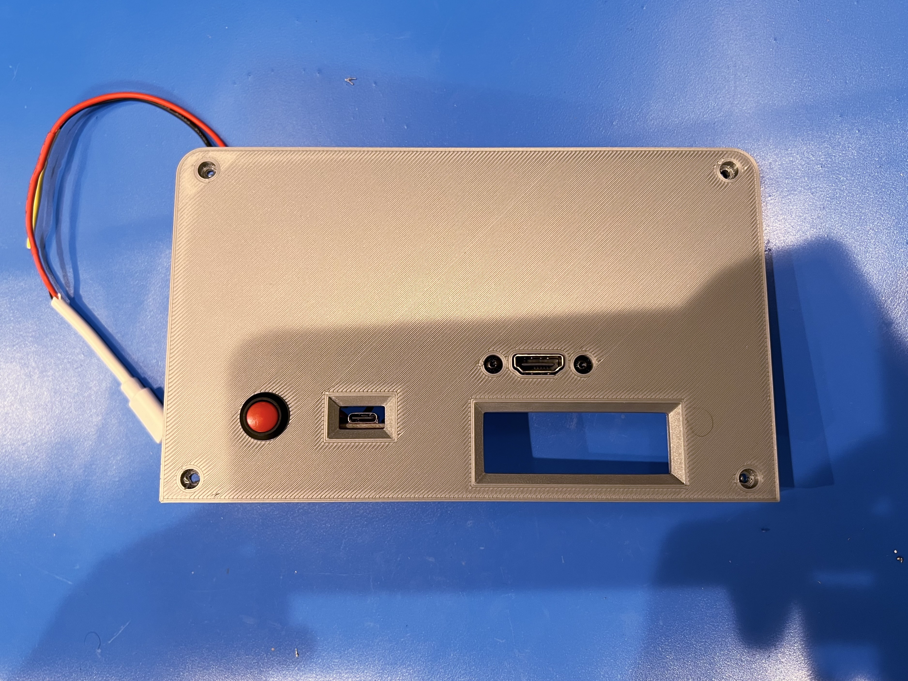
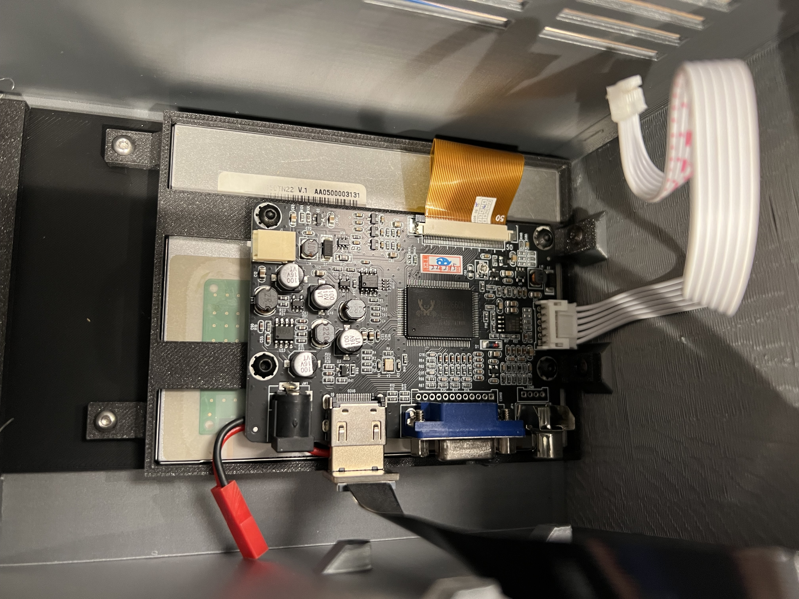
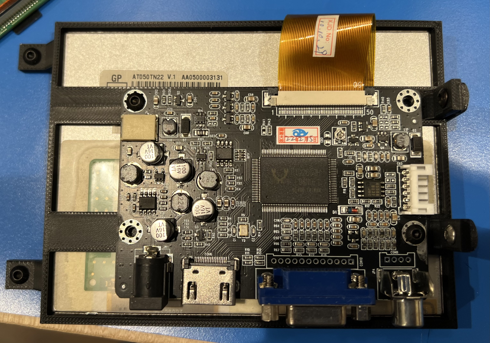
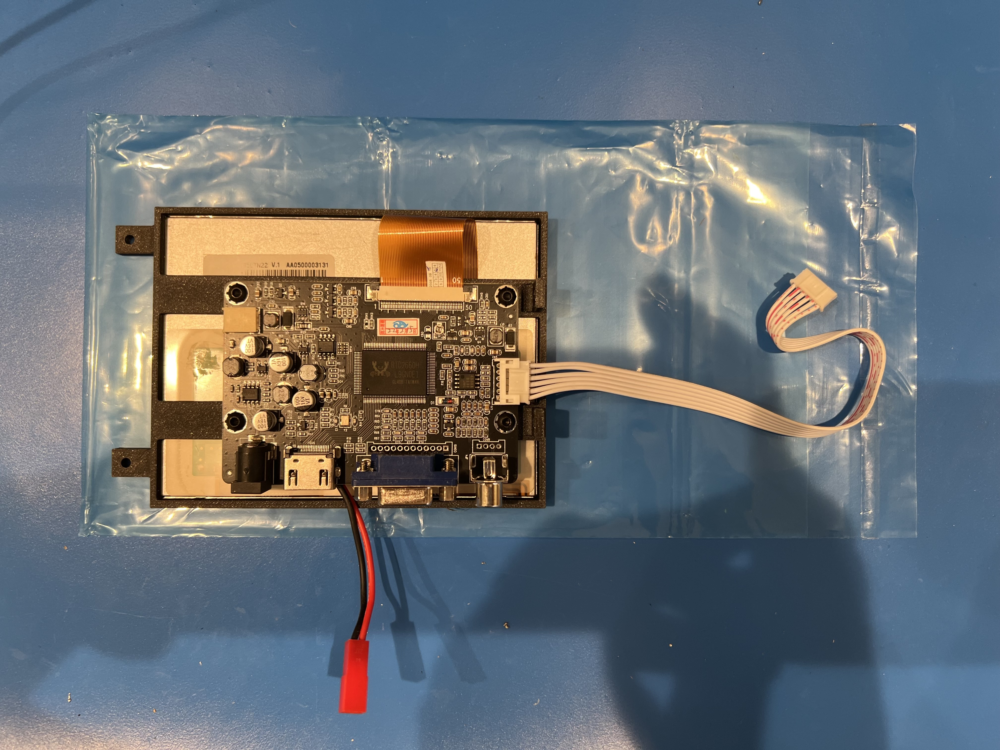
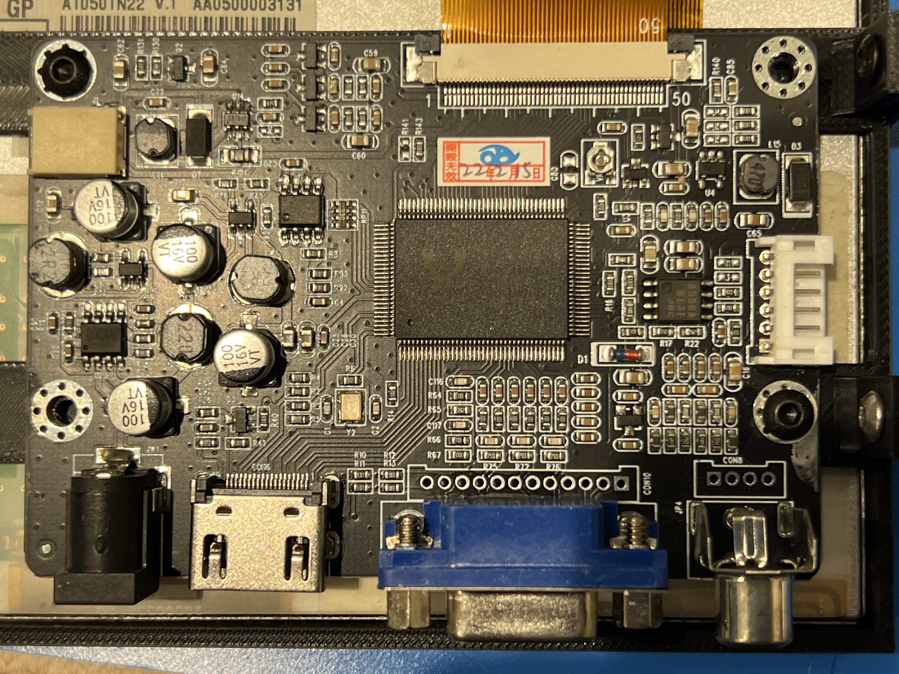
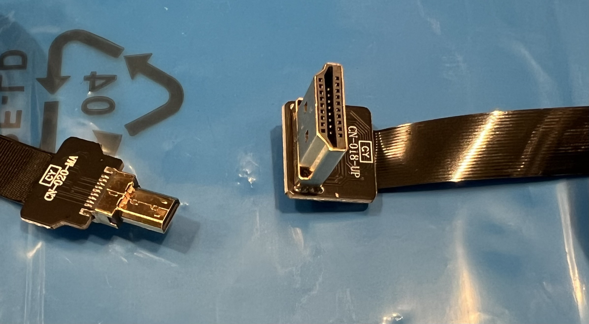
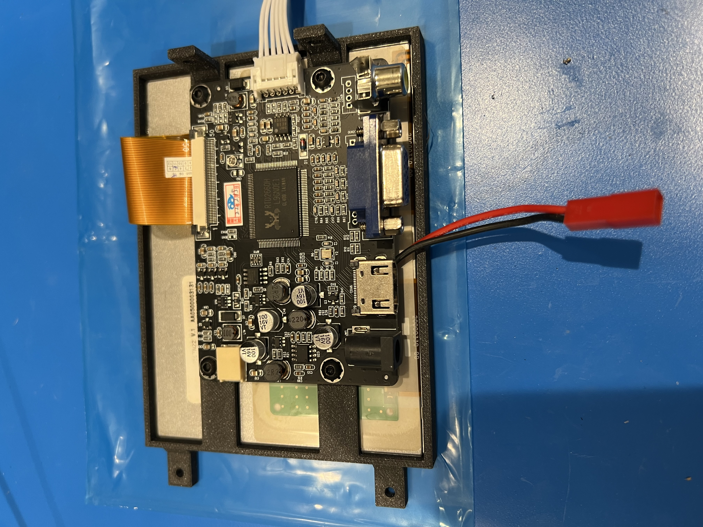
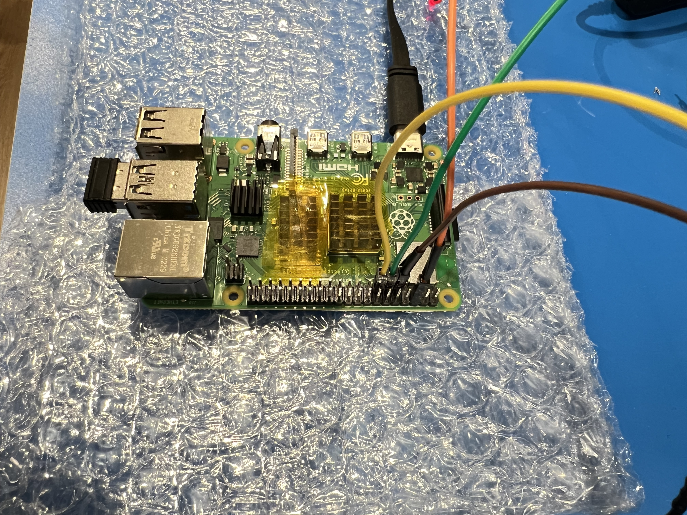

## Printing the Parts

Printing and assembling this model will take some time. The largest part, the main case, requires supports and takes me about 10.5 hours to print on a BambuLab X1. All of the STLs will import into your slicer in the orientation in which I printed them. STLs that need supports have “(NS)” in the name.

* **Back Cover**. There are two options for this model, but you should only print one. 
  * *Back Cover with HDMI Opening.stl*: Has an opening for an HDMI connector for an external display.
  * *Back Cover without HDMI Opening.stl*: No opening for HDMI connector.
* **Badge.stl**: This badge is glued onto the from of the display in the recessed area between the faux floppy drives. It should be printed with black filament up to the 0.6mm height, then printed in white filament the rest of the way. Use your slicer to set a pause so you can change filament, or use a multi-filament printer.
* **Case**. This is the largest part - the main case. There are two options, but you should only print one. This part requires supports. I used slim tree supports. The choice between the two options depends on your printer and settings, but it can't really hurt to print the one with the strut included. It's not much more time or filament.
  * *Case with Strut (NS).stl*: Has a “strut” towards the top of the model in the “as-printed” orientation. This can help avoid drift in the side walls. The strut can be left in place after printing or snipped out with a sharp blade. 
  * *Case without Strut (NS).stl*: Same, but no strut.
* **Display Clip.stl**. This part screws in to the side of the display and helps to hold the front insert firmly in place.
* **Display Retainer (NS).stl**. This part screws into the main case and the Front Insert to hold the display in place. It also provides a spot to mount the controller board for the display. It requires supports, but they are minimal and easy to remove. I used slim tree supports.
* **Front Insert.stl**. This component fits inside the case and provides the bezel for the screen and the faux floppy disks.

## Required Electronics

* **Raspberry Pi 3/4/5**. I use a model 4 and find the performance completely acceptable. There are many places to source these. To find one you can use [rpilocator](https://rpilocator.com/).
* **5" 640x480 Display**. I used a 4x3 display to get the shape closer to the original aspect ratio, though still not quite as square. These are more difficult to find, but they are [available on eBay](https://www.ebay.com/itm/126148049546) along with the controller board which has an HDMI interface.
* **Keyboard**. The model has a slot for a small wireless keyboard. The model I used will operate using Bluetooth or an included RF dongle. The model I used can be found on [AliExpress](https://www.aliexpress.us/item/3256805302970479.html).
* **USB-C breakout board**. This board fits in the back cover and is the power jack for the model. You can find the board I used on [Amazon](https://www.amazon.com/dp/B09BW3HG49).
* **HDMI Cable**: The display connects to the Raspberry Pi via HDMI, but there is not any space for the typical bulky HDMI cables. I used a flat-flex cable with an up-angle HDMI connector for the display. The other end of the cable will depend on which Pi you use. I used a Flat-flex cable similar to [this one](https://www.amazon.com/JSER-HDMI-Type-Male-Cable/dp/B071FJY2BB), but with a micro-hdmi connector on one end. You can mix and match ends or buy a cable with both ends supplied (check the supplier's Amazon store). Be very careful to get the right one for your setup.
* **Power switch**. You need a standard latching push button. The one I used can be found on [Amazon](https://www.amazon.com/Cylewet-Self-Locking-Latching-Button-CYT1091/dp/B075VBV4QH).
* **Boost Converter**. The display runs on 12V, so you'll need to boost the 5V supply coming in. There are lots of available boost converters. The case has mounting spots for [this one](https://www.amazon.com/gp/product/B0833SQF8Z).
* **LEDs**. The front panel has spots for two 3mm LEDs that are meant to show floppy activity. There are tons of options on Amazon, AliExpress, etc. I have no idea where I got mine.
* **Resistors**. You'll also need a couple of current limiting resistors - one for each LED. I used 68 Ohm resistors, but you can calculate the correct value based on the LEDs that you use.
* **Rear HDMI Port** (optional). You may wish to connect an external monitor to the Raspberry Pi. If so, you'll need a panel-mount female HDMI connector like this one from [Amazon](https://www.amazon.com/gp/product/B087TBTP8S).
* **Wires**
	* **USB Cable End**: I powered my Pi by plugging a USB cable into it as usual. I just used the end of a USB-C cable (since I used a Pi 4) and connected that to the incoming power through the switch.
	* **Various bits**. You'll need a few bits of wire to connect the breakout board, through the switch, to the Pi (via USB cable mentioned above) and the Boost converter. You'll also need wire to connect the output of the boost converter to the display.
	* **Barrel Jack**. You may wish to use a barrel jack to connect the boost converter to the display. I decided to solder wires to the display board rather than use a jack, but that  is up to you.
1. 	* **Female Dupont connectors**. If you want the floppy LEDs to display random activity, you'll need to connect them to pins on the Raspberry pi. The easiest way to accomplish this is to use wires with female Dupont connectors on one end. You can get a set like [this one](https://www.amazon.com/Solderless-Multicolored-Electronic-Breadboard-Protoboard/dp/B09FP1WF8Q) and then just cut off one end and connect the other end to the leads of the LEDs/resistors.

## Required Hardware

You will need an assortment of screws to assemble the model:

* (4) M3x10 socket head or cap head screws to attach the back cover to the case. 
* (2) M3x10 cap head screws if you are using the optional HDMI connector on the back cover.
* (2) M3x4 cap head screws for the USB-C breakout board
* (2) M3x4 cap head screws for the Boost Converter
* (4) M2x4 cap head screws to attach the Raspberry Pi to the case.
* (4) M3x6 cap head screws to attach the display retainer to the Front Insert and Case

## Assembly

After printing the parts, removing supports, and doing any other cleanup/post-processing you see fit, you are ready to assemble the model. The steps below are for the physical assembly, but you'll need to do the wiring along the way. An overview of the wiring is given in a separate section, but is called out in step 8 below.

1. All of the screws mount directly into the plastic of the model. You may want to run some screws into the holes a bit to make it easier to start the screws during the actual assembly process. Do no over-tighten.
  * In particular, ensure you can easily get screws into the holes on the right side of the case (as viewed from the rear). These are printed at the top of the model and may have stray support material in them.
  * Be sure not to screw too far into the back of the Front Insert.
1. Attach the Front Insert to the Case. You will have to angle it in from the back. I use a couple of dabs of CA glue in spots that will not be visible. Before gluing, do a test fit to ensure the bezel is positioned properly and that the faux floppy drives seat into the front of the Case.
1. Attach the Display Clip to the Case using an M3 screw to help hold the Front Insert in place. At this point you may use some hot glue at the top and bottom of the left side of the Front Insert (as viewed from the rear). Don't bother if your insert feels secure.
1. Very carefully thread the flat-flex cable from the display through the Display retainer and connect it to the connector on the display board. It is very easy to rip this cable and extremely hard to fix it. See the photos for proper orientation.
  * **NOTE**: At this point you should have soldered wires to the back of the display board if you are not going to use the barrel connector (see wiring notes below).
1. Screw the display board to the back of the retainer. Use at least 2 screws, but preferably all 4.
1. 1. Install the display, display board, and Display Retainer into the case. Install two screws through the Display Retainer into the Front Insert. Install two more screws through the Display Retainer into the right side of the Case (as viewed from the rear).
  * **NOTE**: The display board comes with a control board with several buttons. The boards are connected to one another through a fairly flat 6-wire cable. You won't be using the control board in normal operation, but it is useful to have it connected during initial setup to adjust things like input source, brightness, etc. It is tough to connect the cable once the display is installed. You may wish to plug in the cable before installing the display assembly. You don't need to leave the control board connected after initial setup, but you can leave the cable installed.
1. Install the Raspberry Pi using four M2 screws.
1. ***Perform wiring as described below***
1. After wiring the LEDs as described below, insert each into one of the holes in the Front Insert and use a dab of hot glue on each to hold them in place.
1. Install the USB C breakout board into the Back cover using two M3 screws
1. If you are using an external HDMI connector, install into the Back Cover now using two M3 screws
1. Install the power switch
1. Install the Boost Converter using two M3 screws
1. After testing the unit, install the back cover using four M3 screws
2. Have a break then move on to Software Setup.

**Reference Images**:

[](images/Assembly/Back_Cover.jpeg)
[](images/Assembly/Display_Assm_Installed.jpeg)
[](images/Assembly/Display_Assm.jpeg)
[](images/Assembly/Display_Board_with_connector.jpeg)
[](images/Assembly/Display_Board.jpeg)
[](images/Assembly/HDMI_Cable.jpeg)


## Wiring

The wiring is fairly simple. You can see most of it in the photos. I will trace through the connections starting with the USB-C connector. Depending on how much you want to facilitate disassembly and changes, you may wish to use two prong connectors at certain spots. Refer to the images to see where I used connectors.

1. Connect V+ on the USB breakout board to one leg of the power switch.
1. Connect the other leg of the power with to the positive (red) leg of the USB Cable End.
1. Also connect the same leg of the power switch to Vin on the Boost converter.
1. Connect GND on the USB breakout board to GNDin on the Boost converter.
1. Also Connect GND on the USB breakout board to to the ground (usually black or white) leg of the USB Cable End.
1. Plug the USB Cable End into the Raspberry Pi.
1. Connect the outputs of the boost converter (Vout and GNDout) to a cable with a male barrel connector on the end. It should correspond to the female barrel connector on the display. Plug in the barrel connector.
1. Connect the angled HDMI connector to the input of the display board.
1. *Alternatively*, solder a red wire and a black wire to the back of the display board. If you look at the board near the barrel jack you'll see pads labeled 12V and GND. If you use this method, it is convent to put some type of 2-pin connector between the Boost converter and display so they can be separated easily. This is the approach I took. 
1. LEDs. You have a couple of options for wiring the LEDs. In either case, solder a resistor to the long leg of each LED.
  1. Option 1 - Always on. In this configuration the LEDs will be on as long as the power switch is on.
      2. Solder wires to the short leg of each LED. Connect both of those wires to the GND connection coming from the breakout board.
      2. Solder wires to the resistor that is connected to the long leg of each LED. Connect those wires to the output side of the switch.
  1. Option 2 - Blinkenlights. In this configuration, a script on the Pi (FauxLEDs.py) will periodically blink the LEDs at random intervals.
      2. Solder a wire with a female Dupont connector to the short leg of each LED. Plug the other end (the Dupont connector) onto pins 6 and 9 of the Pi. Please refer to the Raspberry Pi pinout image in the pictures section. These are both GND pins.
      2. Solder a wire with a female Dupont connector to the free end of each resistor. Plug the other end (the Dupont connector) onto pins 11 and 13 (GPIO 17 and 27) of the Pi. Again, please refer to the Raspberry Pi pinout image in the pictures section.
1. Connect the free end of the HDMI cable to the Raspberry Pi.

**Reference images**:

[](images/Wiring/Back_Cover_Wired.jpeg)
[](images/Wiring/Display_Board_with_Connector_2.jpeg)
[](images/Wiring/RPi_Dupont_Cables.jpeg)

## Software Setup

1. **Prepare Raspberry Pi OS**. Create an image of the Raspberry Pi OS that is appropriate for your Pi. I used 64 bit Raspbian Bookworm for my Pi 4. Don't use the Lite version. You need the window system installed.
1. **Flip the display**. Because of the placement of ports on the display, it must be mounted upside down in the case. This means that the displayed images need to be inverted. This is accomplished using the Screen Preferences in the Raspberry Pi desktop. Selected the inverted option.
1. **Install the emulator**. Download the trs80gp emulator using the download link on [this page](http://48k.ca/trs80gp.html). You'll see both a 64-bit and a 32-bit version. Choose the appropriate one for your Pi and follow the instructions on [the site](http://48k.ca/trs80gp.html) to run the emulator.
1. **Blinkenlights**. If you'd like to get some activity from your floppy LEDs you can use a simple python script that basically blinks the LEDs at random intervals. Use the `runtrs.sh` script to launch the emulator instead of launching it directly. `runtrs.sh` will launch the emulator and the `FauxLED.py` python script for you. Both scripts can be found on [GitHub](https://github.com/jpasqua/FauxTRS/). Depending on your setup, you may need to install the GPIO library on your Pi. To do so, enter the following into a terminal:
```sudo apt-get install python3-rpi.gpio```
