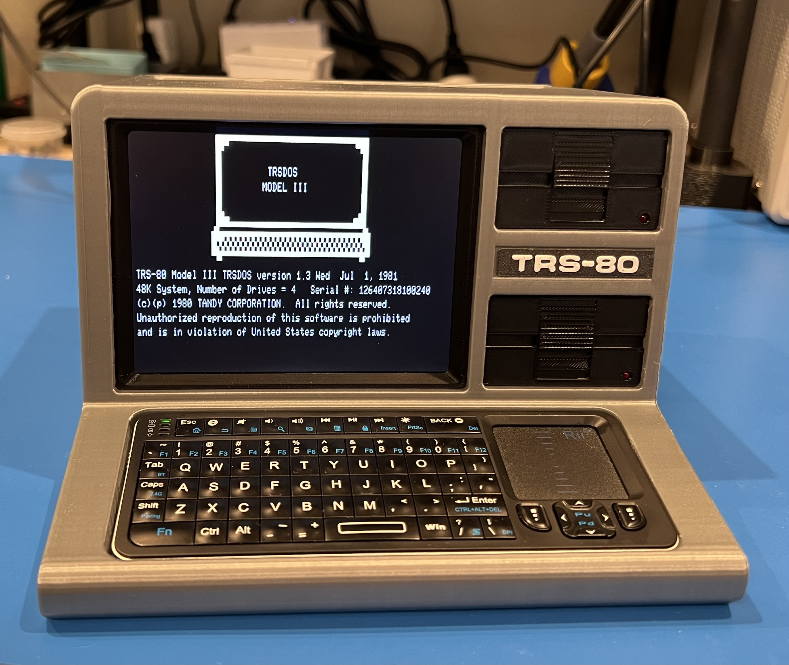

# FauxTRS

This repository contains the instructions for building a Faux TRS-80. The model is meant to evoke the feel of a TRS-80 Model 3 or Model 4 computer, but is not an exact replica of either. It has mounting spots for a Raspberry Pi, display, and associated hardware that allow you to run a TRS-80 emulator and get the true Tandy experience. I use the extremely impressive [trs80gp](http://48k.ca/trs80gp.html) emulator and it works great! Take a look at a [short video](https://www.youtube.com/watch?v=sNZiHpACEHM) of the model in operation.

**[Instructions](Instructions.md)**: This document desribes how to print, assemble, wire, and prepare software for FauxTRS.

***NOTE: THIS IS A WORK IN PROGRESS***

The documentation on required electronics, wiring, and software setup is not complete. At this point you should consider yourself an alpha-tester!

The STL files for FauxTRS can be found on [printables](https://www.printables.com/model/936293-trs-80-inspired-40-scale-model-raspberry-pi-based).

In addition to the [instructions](Instructions.md), the repository contains scripts that can be used to run the emulator and blink LEDs. These aren't necessary for operation of the emulator, but can add a nice effect.

`FauxLEDs.py` is a script that randomly flashes the LEDs on the Faux TRS Model. It is launched by the runtrs.sh script so you don't need to invoke it manually.

`runtrs.sh` is a bash script that can be used to launch the trs80gp emulator and the FauxLEDs script. It will pass along any arguments you provide to trs80gp. If you kill this script (e.g. CTRL-C), it will stop both trs80gp and FauxLEDs, ensuring that the GPIO susbsystem is cleaned up properly.

## Other Models

If your vintage computer tastes run more towards classic Macs, check out the [Faux Mac](https://github.com/jpasqua/FauxMac). If you're a DEC person, check out the [Faux VT100](https://github.com/jpasqua/FauxVT).

## Potential Future Work

* **Audio**: Add an internal audio amp and speaker. You can [set up an external bluetooth speaker or headphones](https://www.okdo.com/project/set-up-a-bluetooth-speaker-with-a-raspberry-pi/) to get audio from the Pi. In the future I may add an internal audio amp and speaker. *However*, at the moment I cannot get audio to work consistently with the emulator.
* **External HDMI Connector**: It might be nice to be able to display on a larger screen when demonstrating the TRS-80 emulator to a group of people. When using a Pi 4 or 5, the secondary HDMI port could go to an HDMI connector on the back panel.

## License: [![CC BY-NC 4.0][cc-by-nc-shield]][cc-by-nc]

This work is licensed under a
[Creative Commons Attribution-NonCommercial 4.0 International License][cc-by-nc].

[![CC BY-NC 4.0][cc-by-nc-image]][cc-by-nc]

[cc-by-nc]: https://creativecommons.org/licenses/by-nc/4.0/
[cc-by-nc-image]: https://licensebuttons.net/l/by-nc/4.0/88x31.png
[cc-by-nc-shield]: https://img.shields.io/badge/License-CC%20BY--NC%204.0-lightgrey.svg
